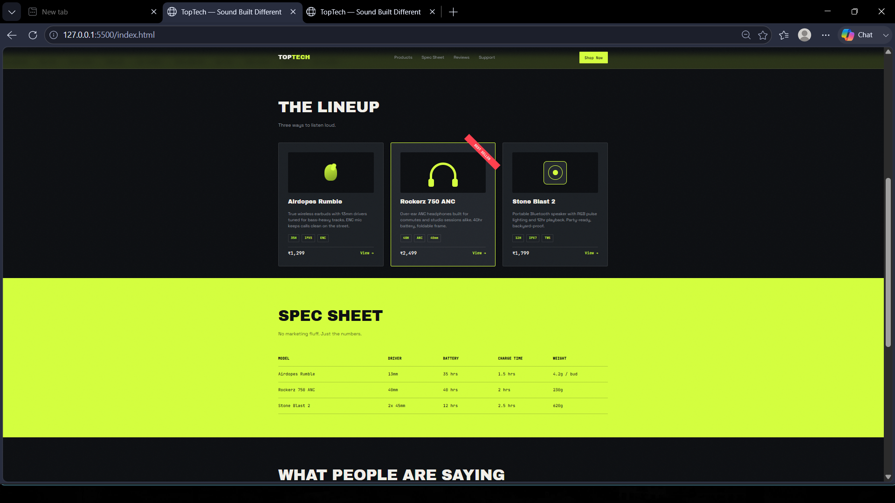

# Ex02 Commercial Website
## Date:

## AIM
To create a commercial website using CSS Flexbox.

## ALGORITHM
### STEP 1
Create an HTML file (index.html)

### STEP 2
Create a CSS file (style.css)

### STEP 3
Include a navigation bar with links to different sections.

### STEP 4
Add structured sections for Homepage, Products / Services, About Us, Contact Details and User Account.

### STEP 5
Include social media links at the footer with copyright information.

### STEP 6
Define global styles for fonts, colors, and layout.

### STEP 7
Style the header, navigation bar, and sections.

### STEP 8
Use Flexbox for layout design.

### STEP 9
Add hover effects and transitions for interactivity.

### STEP 10
Add Images and Media.

### STEP 11
Use optimized images for a professional look.

### STEP 12
Open the HTML file in a browser to check layout and functionality.

### STEP 13
Fix styling issues and refine content placement.

### STEP 14
Deploy the website.

### STEP 15
Upload to GitHub Pages for free hosting.

## PROGRAM
```
<!DOCTYPE html>
<html lang="en">
<head>
  <meta charset="UTF-8">
  <meta name="viewport" content="width=device-width, initial-scale=1.0">
  <title>TopTech — High Performance Audio</title>
  <link rel="preconnect" href="https://fonts.googleapis.com">
  <link href="https://fonts.googleapis.com/css2?family=Plus+Jakarta+Sans:wght@400;600;700;800&display=swap" rel="stylesheet">
  <link rel="stylesheet" href="style.css">
</head>
<body>

  <!-- NAVIGATION -->
  <header class="navbar">
    <div class="container nav-container">
      <a href="#" class="brand-logo">TOP<span>TECH</span></a>
      <nav class="nav-menu">
        <a href="#products" class="nav-link">Products</a>
        <a href="#specs" class="nav-link">Spec Sheet</a>
        <a href="#reviews" class="nav-link">Reviews</a>
      </nav>
      <a href="#products" class="btn btn-primary">Shop Lineup</a>
    </div>
  </header>

  <!-- HERO SECTION -->
  <section class="hero-section">
    <div class="container hero-container">
      <div class="hero-badge">Next-Gen Audio Technology</div>
      <h1 class="hero-heading">PURE SOUND.<br><span class="gradient-text">ZERO COMPROMISE.</span></h1>
      <p class="hero-description">
        Engineered for maximum clarity, deep bass response, and all-day endurance. TopTech delivers high-definition wireless sound crafted for the loud-minded.
      </p>
      <div class="hero-btn-group">
        <a href="#products" class="btn btn-primary btn-large">Explore Products</a>
        <a href="#specs" class="btn btn-outline btn-large">View Specifications</a>
      </div>
      <div class="hero-stats-grid">
        <div class="stat-card">
          <span class="stat-value">40H</span>
          <span class="stat-label">Playback Time</span>
        </div>
        <div class="stat-card">
          <span class="stat-value">₹999</span>
          <span class="stat-label">Starting Price</span>
        </div>
        <div class="stat-card">
          <span class="stat-value">2.1M+</span>
          <span class="stat-label">Happy Listeners</span>
        </div>
      </div>
    </div>
  </section>

  <!-- FEATURE TICKER -->
  <div class="ticker-bar">
    <div class="ticker-content">
      <span>ULTRA BASS</span> • <span>ACTIVE NOISE CANCELLATION</span> • <span>ENVIRONMENTAL NOISE CANCELLATION</span> • <span>WATER RESISTANT</span> • <span>LOW LATENCY GAMING</span> • 
      <span>ULTRA BASS</span> • <span>ACTIVE NOISE CANCELLATION</span> • <span>ENVIRONMENTAL NOISE CANCELLATION</span> • <span>WATER RESISTANT</span> • <span>LOW LATENCY GAMING</span>
    </div>
  </div>

  <!-- PRODUCTS SECTION -->
  <section id="products" class="products-section">
    <div class="container">
      <div class="section-title">
        <h2>FEATURED LINEUP</h2>
        <p>Choose your way to experience studio-grade sound.</p>
      </div>

      <div class="products-flex">
        <!-- Product 1 -->
        <div class="product-card">
          <div class="product-tag">Wireless</div>
          <div class="product-icon">🎧</div>
          <h3>Airdopes Rumble</h3>
          <p>TWS earbuds with 13mm bass drivers and clear voice ENC technology for crisp daily calls.</p>
          <div class="product-features">
            <span>35H Battery</span>
            <span>IPX5 Rating</span>
            <span>ENC Mic</span>
          </div>
          <div class="product-bottom">
            <span class="product-price">₹1,299</span>
            <a href="#" class="btn btn-outline btn-sm">Buy Now</a>
          </div>
        </div>

        <!-- Product 2 (Featured) -->
        <div class="product-card featured-card">
          <div class="product-tag tag-featured">Best Seller</div>
          <div class="product-icon">🎧</div>
          <h3>Rockerz 750 ANC</h3>
          <p>Premium over-ear ANC headphones with plush memory foam cushions and 40-hour endurance.</p>
          <div class="product-features">
            <span>40H Battery</span>
            <span>Hybrid ANC</span>
            <span>40mm Driver</span>
          </div>
          <div class="product-bottom">
            <span class="product-price">₹2,499</span>
            <a href="#" class="btn btn-primary btn-sm">Buy Now</a>
          </div>
        </div>

        <!-- Product 3 -->
        <div class="product-card">
          <div class="product-tag">Outdoor</div>
          <div class="product-icon">🔊</div>
          <h3>Stone Blast 2</h3>
          <p>Rugged Bluetooth speaker featuring dynamic RGB lighting effects and IPX7 waterproof rating.</p>
          <div class="product-features">
            <span>12H Battery</span>
            <span>IPX7 Waterproof</span>
            <span>Dual Stereo</span>
          </div>
          <div class="product-bottom">
            <span class="product-price">₹1,799</span>
            <a href="#" class="btn btn-outline btn-sm">Buy Now</a>
          </div>
        </div>
      </div>
    </div>
  </section>

  <!-- SPECIFICATIONS TABLE -->
  <section id="specs" class="specs-section">
    <div class="container">
      <div class="section-title">
        <h2>TECHNICAL SPECIFICATIONS</h2>
        <p>Full breakdown of technical hardware specs across models.</p>
      </div>

      <div class="table-wrapper">
        <table class="specs-table">
          <thead>
            <tr>
              <th>MODEL</th>
              <th>DRIVER</th>
              <th>BATTERY</th>
              <th>CHARGE TIME</th>
              <th>WEIGHT</th>
            </tr>
          </thead>
          <tbody>
            <tr>
              <td><strong>Airdopes Rumble</strong></td>
              <td>13mm Dynamic</td>
              <td>35 Hours</td>
              <td>1.5 Hours</td>
              <td>4.2g / earbud</td>
            </tr>
            <tr>
              <td><strong>Rockerz 750 ANC</strong></td>
              <td>40mm Neodymium</td>
              <td>40 Hours</td>
              <td>2.0 Hours</td>
              <td>230g</td>
            </tr>
            <tr>
              <td><strong>Stone Blast 2</strong></td>
              <td>2x 45mm Stereo</td>
              <td>12 Hours</td>
              <td>2.5 Hours</td>
              <td>620g</td>
            </tr>
          </tbody>
        </table>
      </div>
    </div>
  </section>

  <!-- REVIEWS SECTION -->
  <section id="reviews" class="reviews-section">
    <div class="container">
      <div class="section-title">
        <h2>VERIFIED REVIEWS</h2>
        <p>See what real users have to say about TopTech gear.</p>
      </div>

      <div class="reviews-flex">
        <div class="review-card">
          <div class="rating">★★★★★</div>
          <p class="review-text">"Bass on the Rumble hits harder than earbuds twice the price. ENC actually works on my daily commute."</p>
          <span class="reviewer-name">— Ananya R.</span>
        </div>

        <div class="review-card">
          <div class="rating">★★★★★</div>
          <p class="review-text">"Wore the Rockerz through a 9 hour flight, ANC held up the whole way and it still had plenty of battery left."</p>
          <span class="reviewer-name">— Karthik S.</span>
        </div>

        <div class="review-card">
          <div class="rating">★★★★★</div>
          <p class="review-text">"Stone Blast 2 survived an outdoor party in heavy rain. Genuinely impressed by the IPX7 waterproofing."</p>
          <span class="reviewer-name">— Meera D.</span>
        </div>
      </div>
    </div>
  </section>

  <!-- FOOTER -->
  <footer class="footer">
    <div class="container footer-container">
      <div class="footer-info">
        <a href="#" class="brand-logo">TOP<span>TECH</span></a>
        <p>Engineered for high performance, immersive audio experiences.</p>
      </div>
      <div class="footer-bottom">
        <p>&copy; 2026 TopTech Audio Pvt. Ltd. All rights reserved.</p>
      </div>
    </div>
  </footer>

</body>
</html>
```
CSS code
```
/* GLOBAL RESETS & STYLES */
* {
  margin: 0;
  padding: 0;
  box-sizing: border-box;
}

body {
  font-family: 'Plus Jakarta Sans', sans-serif;
  background-color: #0b0f17;
  color: #e2e8f0;
  line-height: 1.6;
}

.container {
  max-width: 1140px;
  margin: 0 auto;
  padding: 0 20px;
}

a {
  text-decoration: none;
  color: inherit;
}

/* BUTTONS */
.btn {
  display: inline-flex;
  align-items: center;
  justify-content: center;
  padding: 10px 22px;
  border-radius: 8px;
  font-weight: 600;
  font-size: 0.95rem;
  transition: all 0.3s ease;
  cursor: pointer;
}

.btn-primary {
  background: linear-gradient(135deg, #6366f1, #4f46e5);
  color: #ffffff;
  border: none;
}

.btn-primary:hover {
  background: linear-gradient(135deg, #4f46e5, #4338ca);
  box-shadow: 0 4px 15px rgba(99, 102, 241, 0.4);
}

.btn-outline {
  background: transparent;
  color: #e2e8f0;
  border: 1px solid #334155;
}

.btn-outline:hover {
  background: #1e293b;
  border-color: #64748b;
}

.btn-large {
  padding: 14px 28px;
  font-size: 1.05rem;
}

.btn-sm {
  padding: 8px 16px;
  font-size: 0.85rem;
}

/* NAVBAR */
.navbar {
  position: sticky;
  top: 0;
  background-color: rgba(11, 15, 23, 0.85);
  backdrop-filter: blur(12px);
  border-bottom: 1px solid #1e293b;
  z-index: 1000;
  padding: 16px 0;
}

.nav-container {
  display: flex;
  align-items: center;
  justify-content: space-between;
}

.brand-logo {
  font-size: 1.5rem;
  font-weight: 800;
  letter-spacing: -0.5px;
  color: #ffffff;
}

.brand-logo span {
  color: #6366f1;
}

.nav-menu {
  display: flex;
  gap: 30px;
}

.nav-link {
  color: #94a3b8;
  font-weight: 500;
  transition: color 0.2s ease;
}

.nav-link:hover {
  color: #ffffff;
}

/* HERO SECTION */
.hero-section {
  padding: 80px 0 60px;
  text-align: center;
}

.hero-badge {
  display: inline-block;
  padding: 6px 16px;
  background-color: rgba(99, 102, 241, 0.1);
  border: 1px solid rgba(99, 102, 241, 0.3);
  color: #818cf8;
  border-radius: 50px;
  font-size: 0.85rem;
  font-weight: 600;
  margin-bottom: 24px;
}

.hero-heading {
  font-size: 3.2rem;
  font-weight: 800;
  line-height: 1.15;
  margin-bottom: 20px;
}

.gradient-text {
  background: linear-gradient(135deg, #818cf8, #c084fc);
  -webkit-background-clip: text;
  -webkit-text-fill-color: transparent;
}

.hero-description {
  max-width: 650px;
  margin: 0 auto 36px;
  color: #94a3b8;
  font-size: 1.1rem;
}

.hero-btn-group {
  display: flex;
  justify-content: center;
  gap: 16px;
  margin-bottom: 60px;
}

.hero-stats-grid {
  display: flex;
  justify-content: center;
  gap: 40px;
  background: #161e2e;
  padding: 24px;
  border-radius: 16px;
  border: 1px solid #1e293b;
  max-width: 700px;
  margin: 0 auto;
}

.stat-card {
  display: flex;
  flex-direction: column;
}

.stat-value {
  font-size: 1.8rem;
  font-weight: 800;
  color: #ffffff;
}

.stat-label {
  font-size: 0.85rem;
  color: #64748b;
}

/* TICKER */
.ticker-bar {
  background-color: #1e1b4b;
  border-y: 1px solid #312e81;
  padding: 12px 0;
  overflow: hidden;
  white-space: nowrap;
}

.ticker-content {
  display: inline-block;
  font-size: 0.85rem;
  font-weight: 700;
  color: #a5b4fc;
  letter-spacing: 1px;
}

/* SECTION TITLES */
.section-title {
  text-align: center;
  margin-bottom: 50px;
}

.section-title h2 {
  font-size: 2rem;
  font-weight: 800;
  color: #ffffff;
  margin-bottom: 8px;
}

.section-title p {
  color: #64748b;
}

/* PRODUCTS SECTION */
.products-section {
  padding: 90px 0;
}

.products-flex {
  display: flex;
  gap: 24px;
  justify-content: center;
  flex-wrap: wrap;
}

.product-card {
  background-color: #161e2e;
  border: 1px solid #1e293b;
  border-radius: 16px;
  padding: 28px;
  flex: 1;
  min-width: 280px;
  max-width: 350px;
  display: flex;
  flex-direction: column;
  position: relative;
  transition: transform 0.3s ease, border-color 0.3s ease;
}

.product-card:hover {
  transform: translateY(-6px);
  border-color: #334155;
}

.featured-card {
  border-color: #6366f1;
  background-color: #1a2236;
}

.product-tag {
  align-self: flex-start;
  padding: 4px 10px;
  background: #1e293b;
  border-radius: 6px;
  font-size: 0.75rem;
  font-weight: 600;
  color: #94a3b8;
  margin-bottom: 16px;
}

.tag-featured {
  background: #4f46e5;
  color: #ffffff;
}

.product-icon {
  font-size: 2.5rem;
  margin-bottom: 12px;
}

.product-card h3 {
  font-size: 1.3rem;
  color: #ffffff;
  margin-bottom: 8px;
}

.product-card p {
  font-size: 0.9rem;
  color: #94a3b8;
  margin-bottom: 20px;
  flex-grow: 1;
}

.product-features {
  display: flex;
  gap: 8px;
  margin-bottom: 24px;
  flex-wrap: wrap;
}

.product-features span {
  background-color: #0b0f17;
  padding: 4px 10px;
  border-radius: 6px;
  font-size: 0.75rem;
  color: #cbd5e1;
}

.product-bottom {
  display: flex;
  align-items: center;
  justify-content: space-between;
  border-top: 1px solid #1e293b;
  padding-top: 16px;
}

.product-price {
  font-size: 1.25rem;
  font-weight: 800;
  color: #ffffff;
}

/* SPECS TABLE */
.specs-section {
  padding: 80px 0;
  background-color: #0f172a;
}

.table-wrapper {
  overflow-x: auto;
}

.specs-table {
  width: 100%;
  border-collapse: collapse;
  text-align: left;
  background: #161e2e;
  border-radius: 12px;
  overflow: hidden;
  border: 1px solid #1e293b;
}

.specs-table th, .specs-table td {
  padding: 16px 20px;
  border-bottom: 1px solid #1e293b;
}

.specs-table th {
  background-color: #1e293b;
  color: #818cf8;
  font-size: 0.85rem;
  letter-spacing: 0.5px;
}

.specs-table td {
  color: #cbd5e1;
  font-size: 0.95rem;
}

/* REVIEWS */
.reviews-section {
  padding: 90px 0;
}

.reviews-flex {
  display: flex;
  gap: 24px;
  justify-content: center;
  flex-wrap: wrap;
}

.review-card {
  background-color: #161e2e;
  border: 1px solid #1e293b;
  padding: 24px;
  border-radius: 12px;
  flex: 1;
  min-width: 280px;
  max-width: 350px;
}

.rating {
  color: #f59e0b;
  margin-bottom: 12px;
}

.review-text {
  font-size: 0.95rem;
  color: #cbd5e1;
  margin-bottom: 16px;
  font-style: italic;
}

.reviewer-name {
  font-size: 0.85rem;
  color: #64748b;
  font-weight: 600;
}

/* FOOTER */
.footer {
  border-top: 1px solid #1e293b;
  padding: 40px 0;
  text-align: center;
  background-color: #0b0f17;
}

.footer-info p {
  color: #64748b;
  font-size: 0.9rem;
  margin-top: 8px;
  margin-bottom: 20px;
}

.footer-bottom p {
  color: #475569;
  font-size: 0.8rem;
}

/* RESPONSIVE DESIGN */
@media (max-width: 768px) {
  .nav-menu {
    display: none;
  }
  .hero-heading {
    font-size: 2.2rem;
  }
  .hero-stats-grid {
    flex-direction: column;
    gap: 16px;
  }
}
```
## OUTPUT



## RESULT
The program for creating commercial website using CSS Flexbox is executed successfully.
